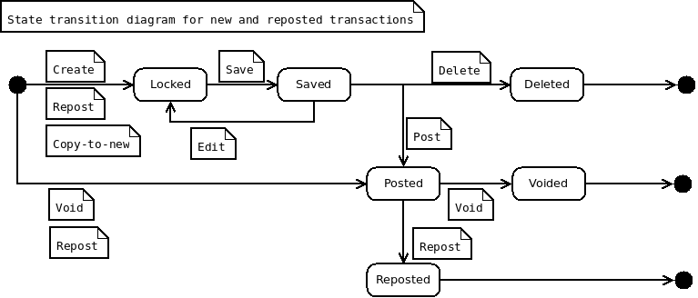

# 0014 Creation of a REST web service API -- not using JSON:API

Date: Unknown

## Status

Accepted

## Context

The most common application integration pattern on modern applications
has become the "REST web service API" for active integration and the
related "webhook" for passive ("event driven") integration.

REST is considered to be an approach to take when an application needs
to "talk to" applications outside the control of the developer of the
application under consideration.  For LedgerSMB, the main purpose of
wanting to develop a web service API is exactly that: the capability to
allow others to integrate with the application.

Next to this main goal of developing an API for third party access, the
API will be used by the newly developed browser-based UI.

Defacto standard for documenting web service APIs is [Swagger/OpenAPI](https://swagger.io/specification/).

### Understanding REST

Although REST - to most projects - means "an HTTP based
access method which encodes its request and response bodies in JSON",
REST is actually an architectural style for integration between clients
and servers with 6 central constraints (of which one is optional), as
very well explained by [Bob Jones from RedHat in his July 1st, 2020
blog on REST architecture](https://www.redhat.com/en/blog/rest-architecture).

From the referenced article - and others like it - it is important to
note several things:

 * A resource is an abstract concept, which has one or more representations
 * A resource has a unique URL from which its representations can be
   requested
 * A resource is considered to be in a specific state
 * A resource may change state through transitions
 * Each representation conveys the allowable and applicable
   (to the respresentation) state transitions

From the above, it's important to conclude that it's not *only* important
to convey links to related resources, but even more to convey the allowed
transitions a client can invoke on a resource.

The consequence of the server providing the client with a set of invocable
state transitions, is that it is the *server* which is knowledgeable of the
states of the resource.  This means that a new server can be deployed with
different states and different transitions, *without the need for deployment
of a new client*.

The concept of marshalling available transitions in the representation is
known as "Hypermedia as the Engine of Application State (HATEOAS)", as
Bob Jones touches upon.  No standard for HATEOAS defines a conclusively
"best" solution to marshall the actions, [the resoure that Bob
references](https://sookocheff.com/post/api/on-choosing-a-hypermedia-format/),
finds.

### Application to LedgerSMB

Let's consider a specific invoice - with number 123 - to map the concepts
of the prior section to LedgerSMB and its resources.  The invoice is in
the "Saved" state.

Given the fact that the API is hosted on the URL path `/erp/api/v0`, the
invoice is associated with `https://example.com/erp/api/v0/invoices/123`.
The lines on the invoice are *defining* part of the invoice, since the
invoice total amount is the result of the parts prices (which may differ
per invoice, number invoiced and customer -- the price matrix components),
discounts and (shipping) address (which can impact taxes).  This is stressed
even more by the fact that once the invoice is posted, no more lines can
ever be added to the invoice anymore.  This is a major difference with the
blog-post-and-comments example of related resources that is used throughout
the JSON:API: once the article has been published, comments can come in.

The invoice has a number of representations, e.g.:

 * PDF
 * HTML
 * JSON

Potentially, more representations can be added, such as PEPPOL XML.

The PDF and HTML representations may be used to share invoices with
customers.  The JSON representation may be used by clients to semantically
understand the data and allowing entry and modification of the invoice.

The state transition diagram for invoices shown below, shows how different
actions are available in each state the invoice might be in.  The last bullet
in the previous section ("each representation conveys ... state transitions")
means that the server will need to indicate the "Edit", "Post", and "Delete"
transitions for the invoice (it's in the "Saved" state).  These state
transitions are generally known as "

 

The fact that the available actions come from the server means that the
client must know how to render the representation *and* its actions.  For
this to work, the server and client need to have a common definition of
how to convey this information, beyond "JSON".

### Evaluating JSON:API for LedgerSMB's REST API

Many applications delivering a web service API have standardized on
[JSON:API](https://jsonapi.org/).  Although lots of applications
develop their own - custom - API practices.

The project aims to create a REST web service API in line with common
practice.  JSON:API was evaluated as a well supported standard with
tooling available, to build this REST web service API on.

For the purpose of evaluating suitablility of JSON:API as the foundation
for LedgerSMB's API, the API for the invoice resource was considered.
The following findings come from the evaluation:

 * JSON:API has a provision for referencing related resources, such
   as part referenced from invoice lines (or invoice lines from the invoice)
 * JSON:API explicitly records relationships to related resources in
   its response model (e.g. comments relating to an article)
 * JSON:API does not have any answers to the problem of updating resource
   properties which are themselves arrays or objects, instead preferring
   to approach those as related resources
 * JSON:API says nothing about conveying transitions from the server to
   the client

Conclusion: Since JSON:API does not provide sufficient answers to the
problems the project wishes to solve using the web services API as outlined
in the introduction, a custom client needs to be developed to understand
and render the HATEOAS (or other encoding of actions) sent from the client.

### Complications

 * Even though the above talks about "the client", which makes it easy
   to assume reference to the web client that comes with LedgerSMB, this
   assumption is wrong: "the client" can be any client developed anywhere
   to talk to the LedgerSMB API

## Decision

The project will create a REST web services API with strong HATEOAS to make
sure the server is in control of the process a resource goes through.  The
aim being to keep clients thin and low on maintenance.  The API will be
documented using OpenAPI 3.0.x.  The API will *not* make use of the JSON:API
standard, instead opting to develop our own API practices.  These will include
design of:

 * A consistent URL schema, which uses [semantic
   versioning](https://semver.org/) for version numbering
 * OpenAPI documentation of individual endpoints as well as common practices
 * A generic means to convey transitions (HATEOAS)

## Consequences

- A new namespace `/erp/api/` needs to be developed.
- API versioning will happen encoding major version numbers, on the
  `/erp/api/vXX` namespace (where XX is the version number).
- As per semantic versioning, `/erp/api/v0` is the "unstable" API;
  API endpoints will be promoted to `/erp/api/v1` (or higher) once the
  endpoint has been sufficiently stabilized.
- Documentation can (and should) be distributed as rendered HTML from the
  OpenAPI documentation.
- Clients need to be 'thin': they will not include knowledge of the process
  and transitions available to mutate a resource -- the server will present
  these.
- The prior bullet allows for customization of resource specific processes
  using server code and/or server configuration, without impact on the client.

## Annotations
